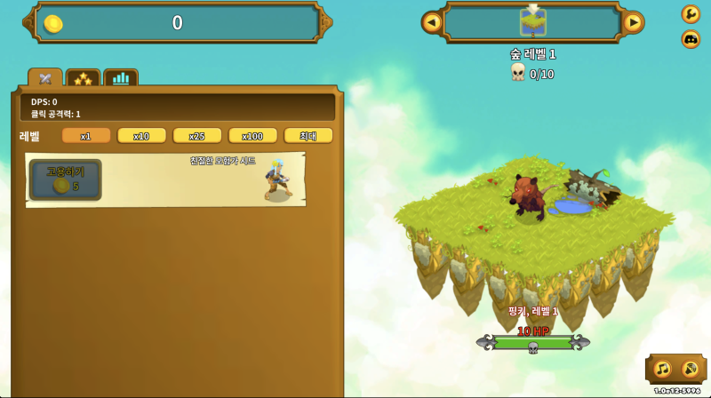
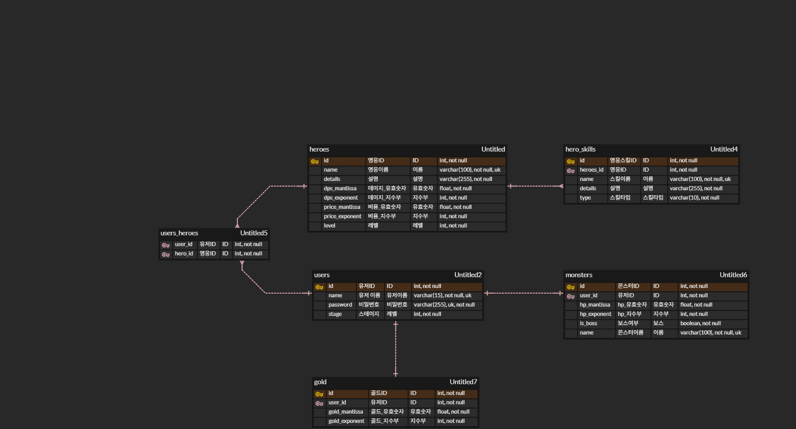

## ClickerHeroes

- 방치형 웹게임 [ClickerHeroes.com](https://www.clickerheroes.com/)을 클론 코딩한다.
- 

### ERD

- 
- [ERDCloud.com](https://www.erdcloud.com/d/8c3JAmZ2Zkdy4m2wa)

# 🎮 Clicker Heroes Clone Project 요구사항 정의서

---

## 1. 계정 및 시스템 기반 (Account & System)

### 1.1 사용자 인증 및 보안

* **회원가입/로그인**: ID/Password 기반 인증을 제공하며, ID 중복 체크 기능을 포함합니다.
* **비밀번호 암호화**: DB 저장 시 `Bcrypt` 또는 `Argon2`를 사용하여 단방향 해시 암호화를 적용합니다.
* **인증 유지**: 로그인 성공 시 `JWT(JSON Web Token)`를 발급하거나 세션을 생성하여 인증 상태를 유지합니다.
* **어뷰징 방지**:
    * 클라이언트에서 계산된 골드/데미지 수치를 서버에서 재검증(Validation)합니다.
    * 비정상적인 클릭 속도(매크로) 감지 시 일시적 제한 로직을 구현합니다.

### 1.2 데이터 구조 및 저장

* **실시간 동기화**: 게임 진행 상황(골드, 스테이지, 영웅 레벨 등)은 1분 주기 혹은 특정 이벤트(보스 클리어, 환생 등) 발생 시 서버 DB에 자동 저장됩니다.
* **초거대 수치 처리(Big Number)**: 무한한 숫자 확장을 위해 `mantissa`(가수, Float)와 `exponent`(지수, Integer) 필드로 나누어
  관리합니다.
    * *예: $1.5 \times 10^{24}$ → mantissa: 1.5, exponent: 24*
* **세이브 파일 관리**: 사용자가 자신의 진행 상황을 문자열 형태로 `Export` 하거나 `Import` 하여 다른 환경에서 복구할 수 있는 기능을 제공합니다.

### 1.3 오프라인 진행 (Offline Progress)

* **방치형 수익 계산**: 마지막 로그아웃 시점과 현재 로그인 시점의 차이를 계산합니다.
* **수익 공식**: `오프라인 시간(초) × 현재 층의 예상 초당 골드 수익`을 산출하여 접속 시 보상 팝업과 함께 일괄 지급합니다.

---

## 2. 전투 및 스테이지 (Combat & Stage)

### 2.1 스테이지 네비게이션

* **일반 스테이지**: 각 층마다 10마리의 일반 몬스터 처치 시 다음 층으로 이동 가능합니다.
* **보스 스테이지**: 10의 배수 층(10, 20...)에서 보스가 등장하며, 처치 시 다음 구역이 해금됩니다.
* **진행 모드 (Progression Mode)**: 활성화 시 자동으로 다음 층으로 넘어가며, 보스전 실패 시 자동으로 이전 층 파밍 모드로 전환됩니다.

### 2.2 데미지 및 전투 로직

* **DPS (Damage Per Second)**: 모든 영웅의 DPS 합산치이며, 0.1초 단위로 몬스터의 HP를 실시간 차감합니다.
* **클릭 데미지 (Click Damage)**:
    * 공식: `기본 클릭 데미지 + (총 DPS의 n%)`.
    * 영웅 업그레이드를 통해 총 DPS가 클릭 데미지에 반영되는 비율을 높일 수 있습니다.
* **보스 타이머**: 보스전 진입 시 30초 제한 시간이 작동하며, 시간 초과 시 강제 후퇴 처리됩니다.

### 2.3 보상 및 드랍 (Gold & Loot)

* **골드 드랍**: 몬스터 HP에 비례하여 지급하며, 보스는 일반 몬스터의 10배를 지급합니다.
* **드랍 연출**: 처치 시 코인이 흩어지는 물리 효과를 주며, 마우스를 올리거나 일정 시간 경과 시 자동 수집됩니다.

---

## 3. 영웅 및 고용 시스템 (Heroes & Hiring)

### 3.1 영웅 관리 및 노출

* **데이터 관계**: 유저(User)와 영웅(Hero)은 `N:M` 관계이며, `users_heroes` 조인 테이블에서 레벨과 스킬 상태를 관리합니다.
* **상점 노출**: 고용된 모든 영웅 + 고용 가능한 다음 영웅 1명을 기본 노출하며, 보유 골드가 충분할 경우 하위 영웅들을 미리 해금합니다.

### 3.2 레벨업 시스템

* **비용 산정**: $Price = BasePrice \times 1.07^{Level}$ 공식을 적용합니다.
* **다중 구매**: `x10`, `x25`, `x100`, `MAX` 구매 모드를 지원합니다.
* **능력치 배율**: 특정 레벨(예: 200레벨 이후 25단위마다) 달성 시 해당 영웅의 DPS가 4배씩 증가하는 멀티플라이어를 적용합니다.

---

## 4. 스킬 및 업그레이드 (Skills)

### 4.1 패시브 업그레이드

* 영웅이 특정 레벨(10, 25, 50, 100...) 달성 시 골드를 소모하여 고유 스킬을 활성화합니다.
* **효과**: 자기 자신 DPS 증가, 전체 DPS 증가, 클릭 데미지 증가, 골드 보너스 등.

### 4.2 액티브 스킬

* 단축키(1~9)를 통해 사용 가능한 강력한 스킬을 제공합니다. (예: 30초간 자동 클릭, 크리티컬 확률 증가 등)
* **쿨타임**: 사용 후 일정 시간 동안 재사용이 불가능하며, 서버 시간을 기준으로 관리하여 재접속 시에도 유지됩니다.

---

## 5. 환생 및 메타 진행 (Ascension)

### 5.1 환생 (Ascension)

* **실행**: 특정 영웅의 'Ascension' 스킬을 사용하여 소프트 리셋을 진행합니다.
* **초기화 항목**: 스테이지 진행도, 보유 골드, 영웅 레벨, 액티브 스킬 상태.
* **유지 및 보상**:
    * **Hero Souls**: 환생 전 영웅들의 총합 레벨 2,000당 1개 지급.
    * **효과**: 보유한 영혼 1개당 전체 DPS 10% 영구 합산 증가.

---

## 6. UI/UX 및 그래픽

### 6.1 시각 효과 (VFX)

* **데미지 팝업**: 타격 위치에서 숫자가 솟구치며 사라지는 애니메이션.
* **화면 흔들림**: 보스 타격이나 대량 데미지 발생 시 미세한 화면 진동 효과.

### 6.2 편의 기능

* **수치 표기**: 단위별 축약(K, M, B, T...) 및 일정 수치 이상 시 과학적 표기법(e+24) 적용.
* **사운드**: 배경음 및 효과음 볼륨 조절, 전체 음소거(Mute) 기능.
